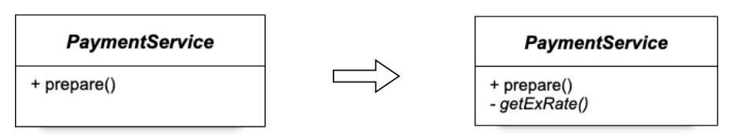

# 섹션3. 오브젝트와 의존관계
## 1. 메소드 추출

- 확장성이 떨어짐
## 2. 상속

- Template Method 패턴
- 상위 클래스에 종속
## 3. 인터페이스
- 관계설정 책임의 분리(Client 도입)

## 4. ObjectFactory 도입

- 개방 폐쇄 원칙(Open-Closed Principle; OCP)
- 높은 응집도와 낮은 결합도(High coherence and low coupling)
- 제어의 역전(Inversion of Control)
## 5. BeanFactory

- 구성 정보를 통해 빈의 의존 관계를 설정

## 6. 캐시

- 데코레이터 패턴? 프록시 패턴?
## 7. 패키지 리팩토링

## 8. DIP
- 의존성 역전 원칙(Dependency Inversion Principle; DIP)
