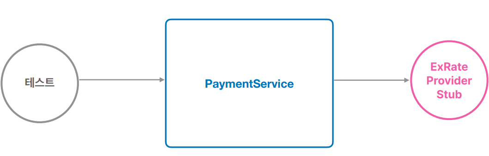
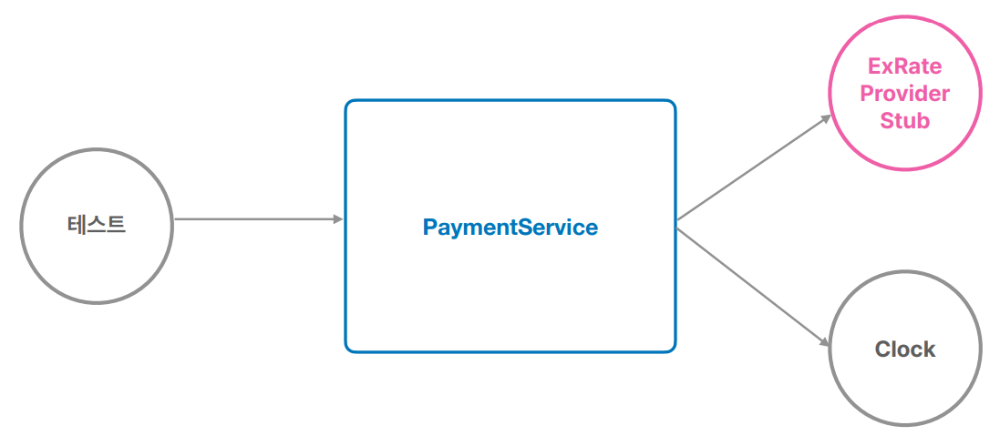
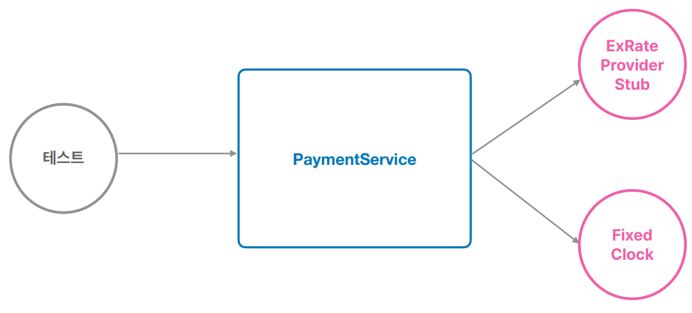

# 섹션4. 테스트
## PaymentService 테스트의 문제점
- 우리가 제어할 수 없는 외부 시스템 문제가 생기면?
- ExRateProvider가 제공하는 완율값으로 계산한 것인가?
- 환율 유효 시간 계산은 정확한 것인가?
## 테스트 구성요소
- 테스트 대상(SUT)
- 테스트
- 협력자(Collaborator)
  - WebApiExRateProvider
    - 외부 서비스와 연동
  - ExRateProviderStub
    - Test Double
## 테스트와 DI
### 수동 DI를 이용하는 테스트
- 테스트용 협력자(Collaborator)/의존 오브젝트를 테스트 대상에 직접 주입하고 테스트
### 스프링 DI를 이용하는 테스트
- 컨테이너로부터 테스트 대상을 가져와서 테스트
  - @ContextConfiguration
  - @Autowired
### 학습 테스트
- 직접 만들지 않은 코드, 라이브러리, 레거시 시스템에 대한 테스트
### 테스트 구현
- 기존 테스트
  - 
- Clock 반영 테스트
  - 
- FixedClock 반영 테스트
  - 
## 도메인 오브젝트 테스트
### 도메인 모델 아키텍처 패턴
- 도메인 로직, 비지니스 로직을 어디에 둘 지를 결정하는 패턴
  - 트랜잭션 스크립트 - 서비스 메소드(PaymentService.prepare)
  - 도메인 모델 - 도메인 모델 오브젝트(Payment)
